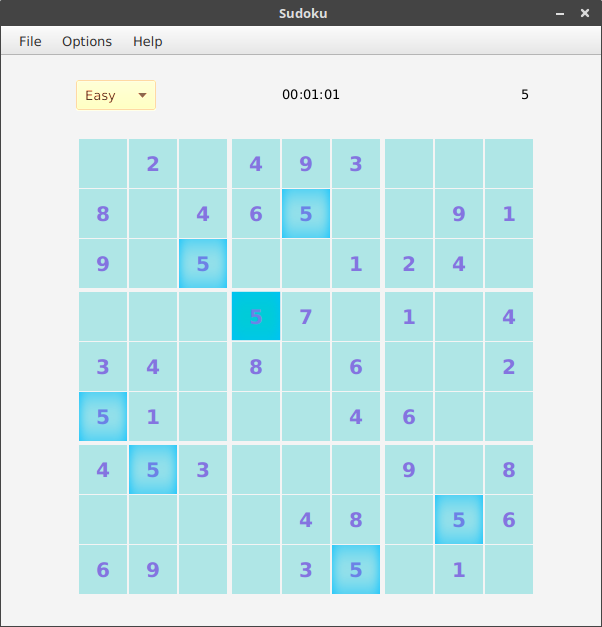

# 数独

基于JavaFX和DLX算法实现的数独游戏，可快速生成和解出数独。

## 操作
 - 移动：方向键 (↑↓←→) 或鼠标。
 - 输入：数字键。

## 功能
 - 难度等级：简单、正常、困难、疯狂。
 - 打开：接收外部已有数独文件。
 - 保存：保存数独。
 - 解数独：解出数独答案并显示。
 - 高亮：高亮所有当前选择的数字。
 - 笔记模式：输入但不作正误判断。
 - 显示候选数：显示当前未确定宫格的所有候选数。
 - 显示当前所选宫格对应的行/列/区域。
